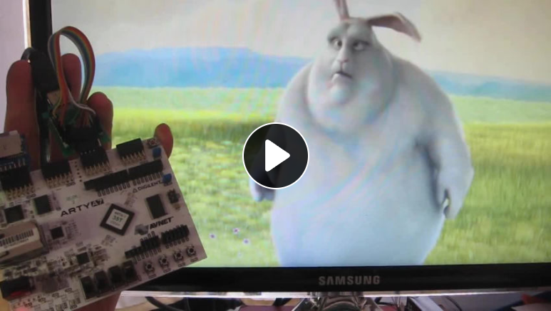

# Movie player
  
This one of the most useful features and challenging tasks of this project: A hardware-accelerated video decoder.
The working principle to play movies is akin to the MJPEG format (Motion JPEG): it decodes individual JPEG files in sequence.

See it in action:
  
<a href="https://peertube.io/w/stGvx1Cg7f5jy5QT8sTUd8"></a>


The video file format is a very simple to manage one: just a TAR file of single JPEG-encoded frames, [accessed](untar.c) from a [SD](fs.c) card by using a provided [FAT filesystem layer](https://github.com/ultraembedded/fat_io_lib) (git submodule fat_io_lib). Each encoded frame is read from the filesystem, while at the same time a previous frame is decoded in hardware. This provides gains in reproduction speed from the simultaneity of software and hardware components.

The original Verilog core [jpeg_core.v](core_jpeg/src_v/jpeg_core.v) was adapted to overcome some restrictions like requiring a image size being a multiple of 8x8 (and matching the screen size), so the core now supports arbitrary resolutions.

The core was also adapted to a Wishbone bus system by removing the external AXI layers and, instead, directly connecting the inner layers to the Wishbone based [SoC](digilent_arty.py) (using the LiteX open source SoC builder). Raw connection to available DRAM ports were used too, including FIFOs, to achieve fast access to the framebuffer memory. See [videcodecs.py](videocodecs.py) for the LiteX adapter implementation.

A [C API](accel_cores.c) is also provided (see function `accel_jpeg_decode`) with an example [movie player](main.c) that, for a smooth reproduction, syncrhonizes frames to the vertical sync of the display hardware.

## Build instructions:
```
make digilent_arty upload
```
This generates a bitstream for the Digilent Arty A7 board.
It is expected a tar file with the movie (just a collection of JPEG frames encoded according to the decoder capabilties) in a FAT formmated SD card, with a PMOD adapter on connector JA, and a DVI compatible display like a PC monitor connected to JC, using raw wires.
