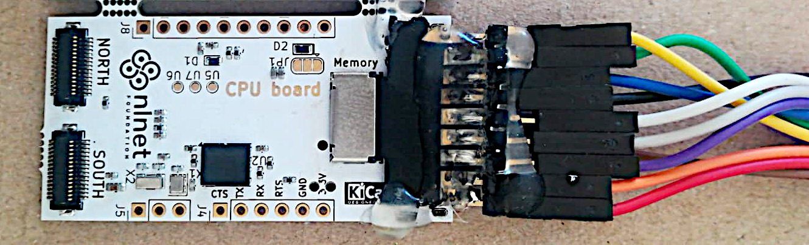
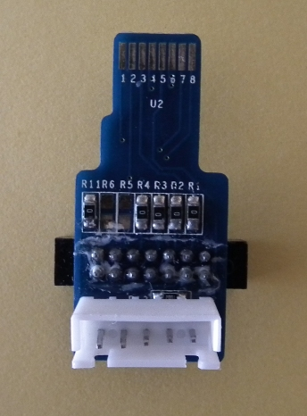
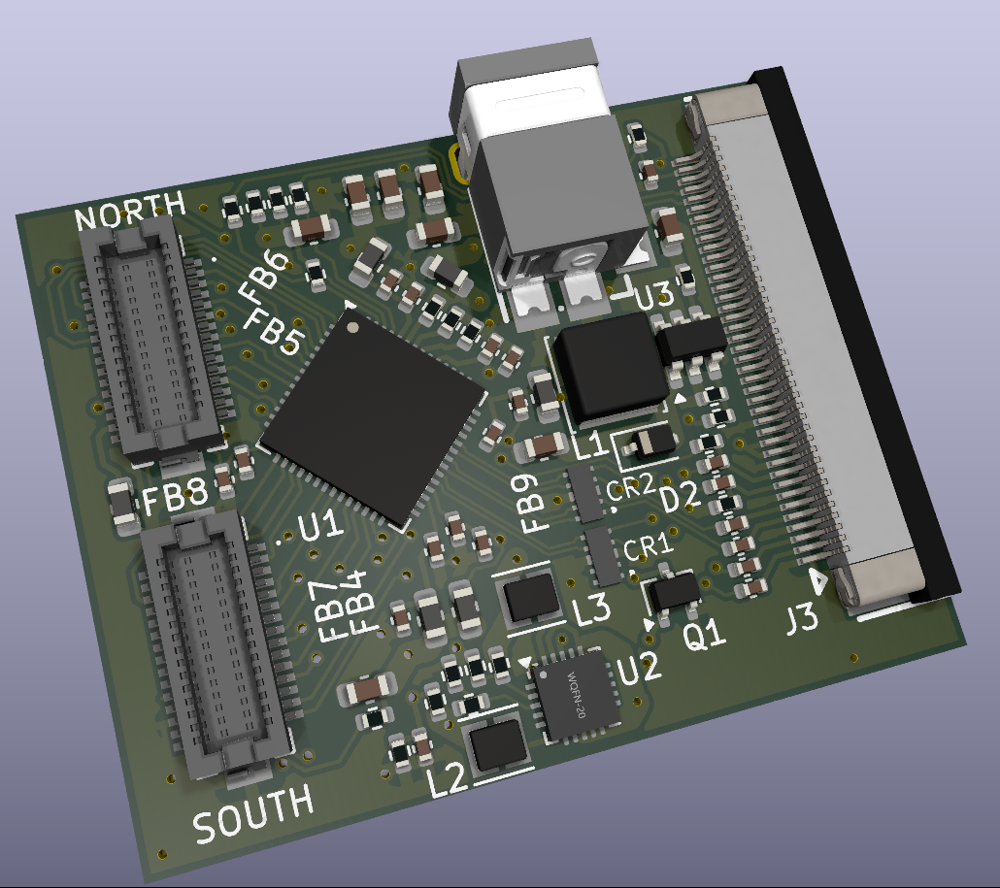
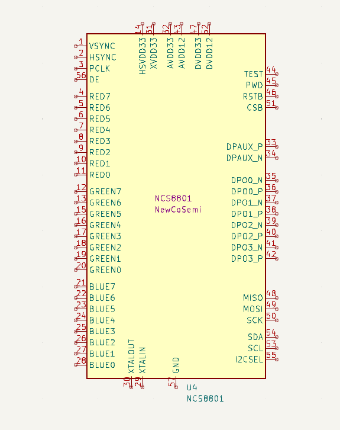
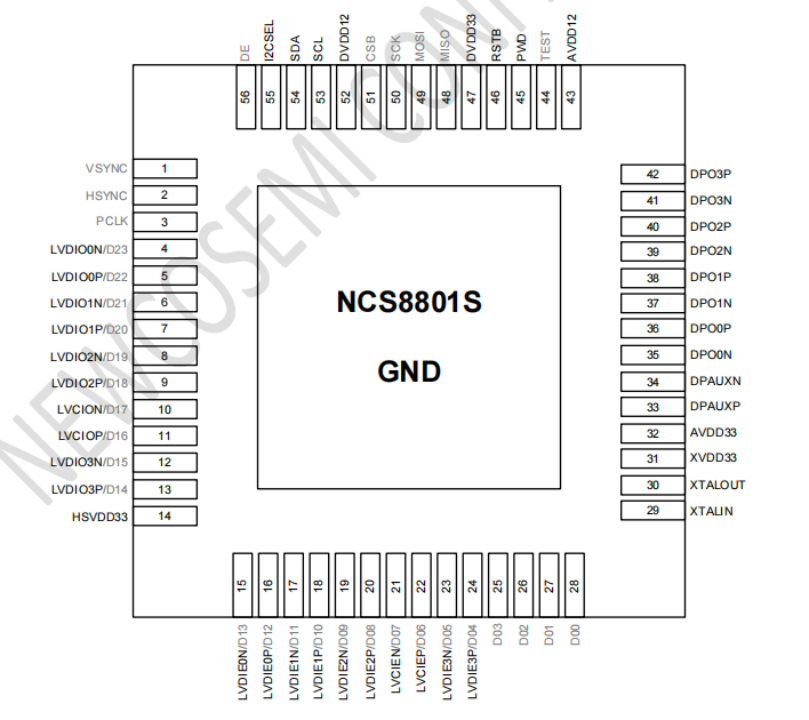
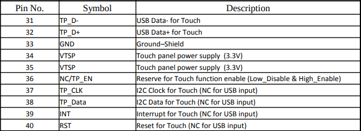
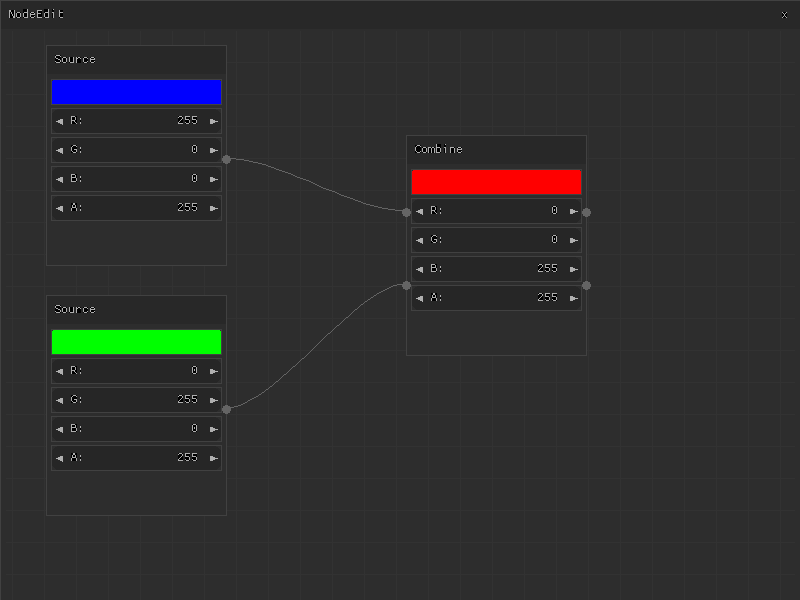

# Visual debugging
The following documentation explains how to run code step by step and explore the MCU's CPU state.
The CPU is accessed via its JTAG pins, so a suitable adapter is required for connection to the development host.

## JTAG adapters
JTAG signals are by default exposed via the SD card interface on the CPU board. To achieve that a homemade adapter was designed using a uSD to MMC adaper:  
  



Alternatively you can use uSD to JTAG adapter the one below. More info [here](https://linux-sunxi.org/MicroSD_Breakout) and [here](https://linux-sunxi.org/JTAG).  
  


To connect to the development host, you can use a homemade JTAG adapter based on a FTDI chip, testing was done  with a DLP-USB1232H module but there are [many other options](https://openocd.org/doc/html/Debug-Adapter-Hardware.html).
  

## OpenOCD config
This is the main development: a configuration that works for this combination of CPU and adapter case. It's loosely based on [this configuration](https://linux-sunxi.org/JTAG/sun4iconfig), note among other changes the correct CPU ID `0x5ba00477`.

```
adapter speed 1000
adapter driver ftdi
ftdi vid_pid 0x0403 0x6010
ftdi layout_init 0x0008 0x000b
ftdi device_desc "Dual RS232-HS"
ftdi channel 0

reset_config none srst_pulls_trst
transport select jtag

set _CHIPNAME t113s3
jtag newtap $_CHIPNAME cpu -irlen 4 -ircapture 0x1 -irmask 0xf -expected-id 0x5ba00477
dap create $_CHIPNAME.dap -chain-position $_CHIPNAME.cpu
target create $_CHIPNAME.cpu cortex_a -dap $_CHIPNAME.dap
```
See the file in the repo [here](./target-cpu/f133-bare/openocd-dlp1232h-t113s3.cfg).

## Running OpenOCD
To run OpenOCD with the correct configuration, issue the following command:
```
openocd -f openocd-dlp1232h-t113s3.cfg
```
Which results in the CPU being found:
```
Open On-Chip Debugger 0.12.0-rc3+dev-00001-gdfe57baa1-dirty (2022-12-21-01:55)
Licensed under GNU GPL v2
For bug reports, read
	http://openocd.org/doc/doxygen/bugs.html
T113s3 JTAG Ready for Remote Connections
Info : Listening on port 6666 for tcl connections
Info : Listening on port 4444 for telnet connections
Info : clock speed 1000 kHz
Info : JTAG tap: t113s3.cpu tap/device found: 0x5ba00477 (mfg: 0x23b (ARM Ltd), part: 0xba00, ver: 0x5)
Info : t113s3.cpu: hardware has 6 breakpoints, 4 watchpoints
Info : t113s3.cpu: MPIDR level2 0, cluster 0, core 0, multi core, no SMT
Info : starting gdb server for t113s3.cpu on 3333
Info : Listening on port 3333 for gdb connections
```
Then you test it by running GDB (use multiarch version)

```
gdb-multiarch helloworld_fel
target remote :3333
monitor halt
load
tbreak main
jump _start
```

NOTE: the commands can be put into a .gdbinit file to be automatically loaded with GDB.
  

## Visual GDB

For a nice GDB UI, ease to setup, you can try [gdbgui](https://www.gdbgui.com/)
```
pip install gdbgui
python -m gdbgui
```

Go to [http://127.0.0.1:5000/dashboard](http://127.0.0.1:5000/dashboard)  
Use as command:
```gdb-multiarch helloworld_fel```

And then the GDB commands as above (`target remote :3333`, etc.)
  


## Caveats
Debugging the F133A/D1s (RISC-V) chips **does not work** with open source/custom tools, thus proprietary and expensive tools like [CKLINK](https://github.com/ylyamin/RT-Thread-on-Allwinner-D1H/blob/master/documentation/D1_2_boot_process.md#debbuging-gdb-via-jtag) are required, which works with also propietary software: [Xuantie's](https://www.xrvm.com/) [T-Head Debug Server](https://doc.winnermicro.net/download/debug_server/T-Head_Debugger_Server_User_Guide_EN-US.pdf).  
  
Ater too many failed attemps, including writing a custom firmware to a STM32F103-base board to emulate a CKLINK, this route was abandoned in favor of the open source tools, which works for ARM CPUs so the T113-S3 was used.  
  
For possible alternatives to make the RISC-V CPU work, you can try a [Sipeed debugger](https://github.com/sipeed/RV-Debugger-BL702) since state that the using its debugger hardware, the Xuantie C906 CPU works.

Also you can see [here](https://github.com/cjacker/opensource-toolchain-bouffalo-lab?tab=readme-ov-file#option-2--use-sipeed-rv-debugger-plus-or-m0s-dock-with-cklink-lite-firmware) and [here](https://wiki.sipeed.com/hardware/en/logic_analyzer/combo8/use_cklink_function.html).  

# eDP adapter board
## Connect touch-enabled displays with 40-pin connector eDP (embedded Display Port)

This board is based on the NCS8801S IC from NewCoSemi, a not so famous IC manufacturer but the only one with a chip capable of converting RGB signals to the eDP protocol, instead of requiring LVDS signals like many other similar ICs.

Requirement for this boards are:

- Compatible input connectors (30-pin NORTH and SOUTH)
- Exposure of Touch function pins (I2C protocol)
- Selectable power for touch function: 3.3V or 5V
- Single supply: internal DC-DC for powering backlight from 5V supply (for single supply systems)
- Cable output protection diodes

The design of this board required just 2 layers, providing adequate power supply and ground planes and small size:  





  

This special IC required the design of a custom symbol, according to its [datasheet](https://www.newcosemi.com/product/93.html)

The connector is 40-pin (mostly standarized) with its touch panel interface in pins 30-40:  



Relevant design files are in Kicad format:  
[Schematics](./hardware/eDP_adapter/eDP_adapter.kicad_sch)  
[PCB design file](./hardware/eDP_adapter/eDP_adapter.kicad_pcb)  


# Widget-based UI integration
## Port of Nuklear Immediate mode UI project to use hardware accelerators
After evaluation of various UI frameworks, the Nuklear Immediate Mode UI was selected for since its good balance of simplicity and features. As widgets it support labels, combo boxes, buttons, etc. The Nuklear framework supports various implementations for rendering its mid-level drawing primitives including rectangles (filled and outline), bitmap images, text, shapes like lines/circles/trianges/polygons (filled and outlines). etc. All such high-level UI widgets are drawn based on the mid-level drawing primitives   
  
The implementation of a renderer for Nuklear is achieved by reading a list of such mid-level commands and draw them accordingly.  
  
As a base of the accelerated implementation, a framebuffer-based software rederer was taken: see [nuklear_rawfb.h](./Nuklear/demo/rawfb/nuklear_rawfb.h), particularly the _nk_rawfb_render_ function.  
  
The basic "NodeEdit" demo was selected as an example, since its use of most of the available drawing commands. The demo is implemented in [nuklear_app.cpp](./nuklear_app.cpp) and produces the following result:



For a quick test, the following command can be issued:
```
APP_SRC=nuklear_app make run
```
Or see [Blitting core](#blitting-core) on how to run demos in hardware.

## Implementation

The approach to implement the accelerated renderer consists two basic steps:

1. Reduce the amount of low-level drawing primitives required by the high-level command list
2. Implement a hardware accelerated version of such set, avoiding access to single-pixels to get significant performance gains.

Evaluation of the possible commands resulted in this minimal set of low-level drawing primitives:

1. Line draws (mostly horizontal, but vertical and oblique supported)
2. Image blitting

The way to reduce al the Nuklear mid-level drawing primitives to the above set is by determine how to get a same result using more basic basic primitives, for example: a rectangle outline is based on four lines, a filled rectangle is based on multiple horizontal lines, a polygon is based on multiple oblique lines, and if it's filled then it can be drawn similar to a solid rectangle with multiple horizontal lines possibly of different length. Same happens with respect to a filled circle, etc.

Since the line draw is hardware accelerated, it gives important performance gains (on the order of 5X, depending on UI contents).

Text rendering is handled by blitting of rectangles, by copying portions of a pre-generated font atlas to the corresponding location on the framebuffer. See [Blitting core](#blitting-core) for details on the hardware-accelerated blitting core.

The implementation of the truly basic set of drawing primitives is in [nuklear_app.cpp](./nuklear_app.cpp), particularly _nk_accel_line_ and _nk_accel_image_ functions. Regarding the reduction of the various mid-level drawing primitives to the basic set of two, the relevant code can be seen in [nuklear_rawfb.h](./Nuklear/demo/rawfb/nuklear_rawfb.h), for example the _nk_rawfb_stretch_image_ function, where instead of accesing to the framebuffer a pixel at a time, a hardware accelerated version is invoked.   


# BLITTING CORE
## Simultaneous access to multiple buses from a same accelerator core

This accelerator core permits to copy a block of pixels from a region to another (for example to draw a bitmap in residing in main memory), optionally colorized, and with rectangle fill mode which also allows optional alpha blending.  
The accelerator allows performance improvements of **2X to 10X** depending on mode, with room for more optimizations.

## Interface
As can be appreciated below, parameters src_base and dst_base respectively select source and destination:
```
    MODULE line32a(
      bus_master(bus),
      const int16&	dx,
      const int16&	dy,
      const uint32&	rgba, //color to add
      const uint32&	tint, //source color multiply factor
      const busaddr_t& dst_base,
      const int16& dst_xstride, //normally 1, but can run backwards
      const int16& dst_ystride, //pixels to skip for next line (usually the framebuffer width)
      const busaddr_t& src_base,
      const int16& src_xstride,
      const int16& src_ystride
      )
```
See core's source [line32a.cc](./line32a.cc)
    
Paramenter _tint_ optionally colorizes the source, that means, multiply each color channel by a "tint" coefficient.
Parameter _rgba_ is added to the destination (assumed with pre-multiplied alpha). The combinations allows the following interesting modes:

1. Solid color fill
2. Solid color with alpha blend
3. Bitmap draw as-is, and
4. Colorized bitmap draw (tinted)

The code of the accelerator implementation reflects that conditions to optimize access to the buses (i.e. no source reads when color fill).  
Since the algoritm to select destination pixel coordinates is based on a line drawing algorithm, oblique or vertical lines can be drawn too.  
  
For usage and options, see [blit_app.cpp](./blit_app.cpp), a demo showing the different modes of this accelerator.  
It produces this image:  


## FPGA implementation

See [accel_glue.py](./accel_glue.py) a call to connect_accel_to_native in [wpu.py](./wpu.py), which is based in ConverterWriteCache, using WriteBackCache for cached access.  
Two _native_ ports to the DRAM are used, one for reading the other for writing.  
For usage from firmware, see accel_linea in [accel_cores.c](./accel_cores.c), where registers in the FPGA are set in correspondence with the FPGA core registers.  


## Running

1) Create the bitstream for the FPGA board:  
set APP_SRC=blit_app in Makefile
```
    make clean
    make
```
    
2) prepare to load firmware  
```
    make firmware
    make upload #see below
```
    
Optionally you can copy the main.bin file to the flash memory as boot.bin, and it will run automaticaly at boot (requires --write-flash argument in openFPGALoader command)

3) LOAD bitstream (will actually upload firmware when done)  
```
    openFPGALoader -c ft2232 ./build/gsd_orangecrab/gateware/gsd_orangecrab.bit
```

or its quite cool [web interface](https://ofl.trabucayre.com/).

## Software simuation

As always with this project, the graphic core can be run in software mode (using same C code), command for this is just:
```
    make run
```


## Relevant sources changes

* [accel.py](./accel.py): AccelImporterSoC class, it instances a 2nd port for simultaneous read-write access to main RAM
* [line32a.cc](./line32a.cc): actual accelerator core (as always in this project, capable of running as software or transpiled to verilog)
* [accel_line32a.inl](./accel_line32a.inl): line32a memory-mapped registers layout
* [wpy.py](./wpy.py): updated accelerator interface
* [gsd_orangecrab.py](./gsd_orangecrab.py): Bitstream genration for custom board, direct instancing of the accelerator
* [accel_cores.c](./accel_cores.c): accel_linea function, it calls the hardware acellerated version of line draw which simultaneously access two DRAM ports
* [sw_cores.cpp](./sw_cores.cpp): software implementation (based on same line32a.cc code)
* [bus.h](./bus.h): add macros to allow access to simultaneous ports in accelerators implementations
* [blit_app.cpp](./blit_app.cpp): main testing application


# Scalable font support in vector format

Support for scalable fonts (vector format) was added. It was tested with the openly licensed DejaVuSansMono font (TrueType), drawn at various scales.


Two ways of implementation for the glyph rasterization were tested: one based on signed distance fields (Chlumsky's multichannel version to preserve corners) and a more traditional scanline rasterization.
  
The scanline rasterizer resulted of more performance (about 2X). It's based on the project [Freetype](https://freetype.org/) (GPL licensed), since it allows for a custom scanline drawing callback, that was implemented using the line hardware accelerator core [line32.cc](./line32.cc) for fast drawing of horizontal lines. See the implementation in [freetype_app.cpp](freetype_app.cpp).  

For easy inclusion of the FreeType library (that's certainly quite big), an "amalgamated" version was used which uses just a [header file](./freetype/FreeTypeAmalgam.h) and a [.c source file](./freetype/FreeTypeAmalgam.c).
  
The demo draws a "g" letter showing a very basic "3d-like" effect, implemented by drawing the glyph at different scales and colors. The program shows how to change scale without reloading the glyph at a different size.
  
To draw complete strings, an easy _text_ method was added, see function _text()_ in [accel_canvas.h](./accel_canvas.h). A font cache is also provided to speed up repeated drawing of a same letter in a same size, see _FontManager_ class in the referenced source.


