# Kicad DRC constraints for manufacturing at JLCPCB

This guide aims to design boards that pass DFM analysis, considering JLCPCB's [capabilities specifications](https://jlcpcb.com/capabilities/pcb-capabilities). It assumes designs of at least 4 layers, 1oz copper max thickness, and the ENIG surface finish.

These are, according to JLCPCB at the time of writing:

* Minimum track width/spacing: **0.09mm (3.5 mil)** or 3 mil (0.076mm) acceptable in BGA fan-outs
* Via outer diameter: **0.1mm larger than hole** (0.15mm preferred), half of that corresponds to annular width
* Drill diameter: **0.15mm** (using their most expensive option)
* Via hole to hole Spacing: **0.2mm**
* BGA pad to trace clearance: **0.09mm (3.5 mil)**
* Hole position tolerance: **±0.05 mm**

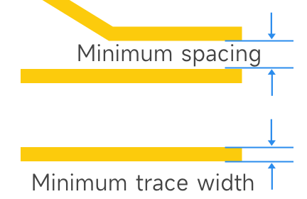
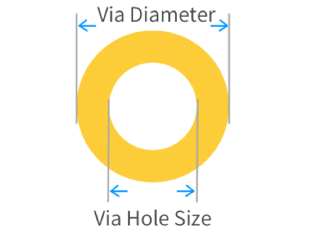
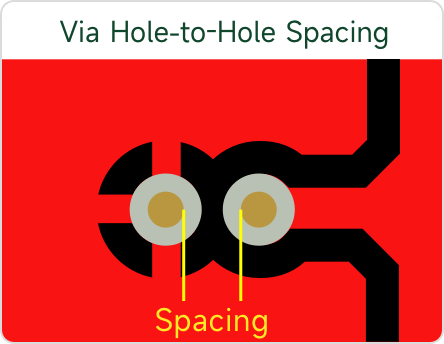
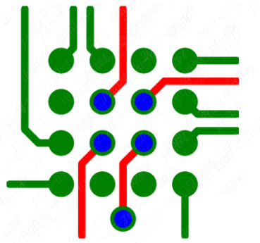

  
## Implications of those constraints

The JLCPCB hole to hole spacing for vias is specified at 0.2mm, implying an annular size of 0.055mm using the clearance of 0.09mm.  But the recommended annular size is 0.075mm, thus the smaller annular size of 0.05mm is risky since it matches the hole position tolerance. As a result, .075mm imposes fewer risks, and allows:

1. A resulting hole-to-hole clearance of **0.24mm**: .075mm (annular ring) + .09mm (clearance) + .075mm (annular ring) and
2. A copper-to-hole clearance of **0.165mm**: .075mm (annular ring) + .09mm (clearance), but note that less than 0.18mm is marked as "danger" by their DFM tool.

In the case of BGA fan-outs (passing 1 track between two pads), they seem to allow 0.556mm as minimum BGA pitch using the VIA-in-pad technology: .075mm (via hole radius) + .075mm (annular ring) + .09mm (clearance) + 0.076mm (track) + .09mm (clearance) + .075 (annular ring) + .075mm (hole radius).
  
Thus, for 0.5mm pitch BGA this does not allow a VIA-in-pad without the hole position tolerance risk. To avoid this risk, a pad of **0.25mm** diameter is recommended, requiring: .125mm (pad radius) + .087mm (clearance) + .076mm (track) + .087mm (clearance) + .125mm (pad radius) = 0.5mm. Note that when a Via-in-Pad is selected, a larger radius than the normal pad may require the pad to be solder-mask defined to match the normal pad radius (you may need to tweak the default solder mask expansion).

## Recommended values
Considering that, the recommended Kicad DRC constraints for 4+ layers with ENIG are:

* 0.090mm Clearance (0.087mm for 0.5mm BGA pitch fan-out)
* 0.090mm Track width (0.076mm for BGA fan out of any pitch)
* 0.075mm Via annular ring (0.050mm minimum, with risks), or 0.200mm if a PTH
* 0.300mm Via outer diameter (0.250mm minimum, or 0.045mm with 0.300mm hole to avoid premium prices)
* 0.180mm Copper-to-hole for outer layers (or less if using 0.050mm annular ring), 0.200mm for inner layers
* 0.200mm Via hole (or 0.150mm at highest costs / 0.300mm lowest cost)
* 0.240mm Via hole to hole (0.200mm minimum by specs assuming 0.055mm annular width). Note that 0.45mm is required for PTH.
  
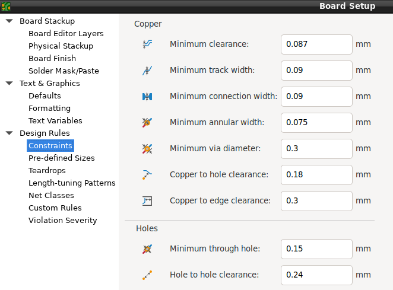

## DFM analysis

According to the previous constraints, the project's multilayer boards were checked against their professional DFM tool, [JLCDFM](https://jlcdfm.com/).

This gives these results:  

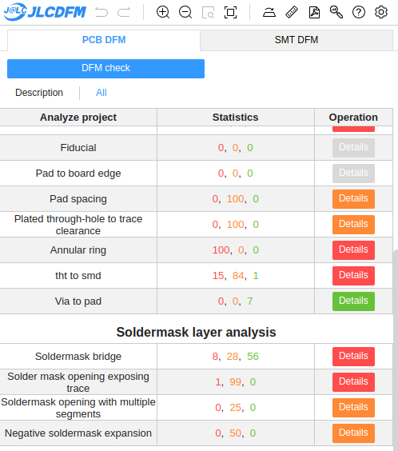

Where the following parameters of the DRC are checked:

* Trace clearance and width
* Pad spacing
* Via or PTH to trace spacing (copper-to-hole)
* Annular ring size

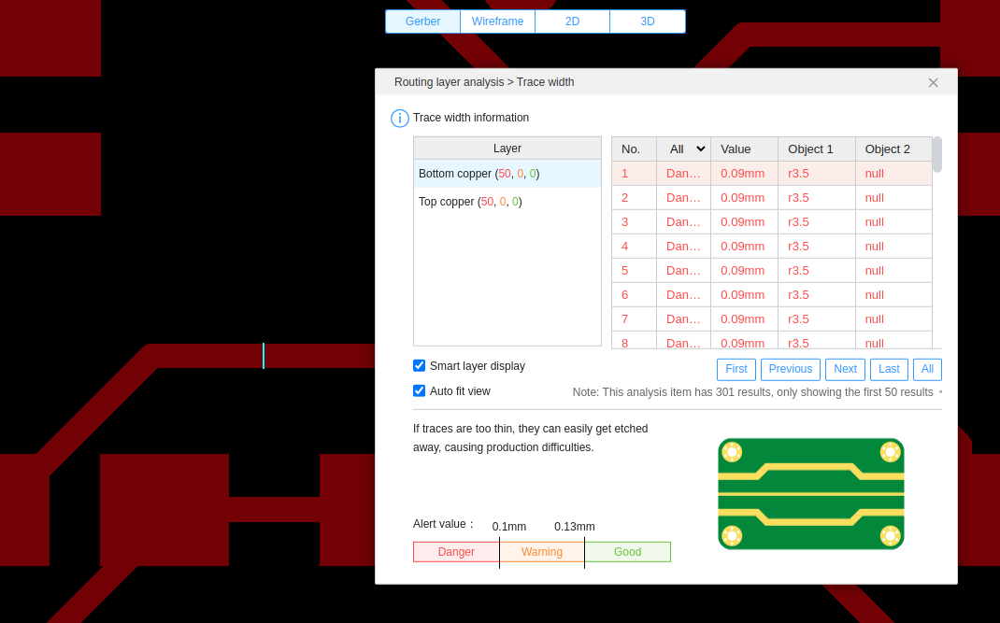  
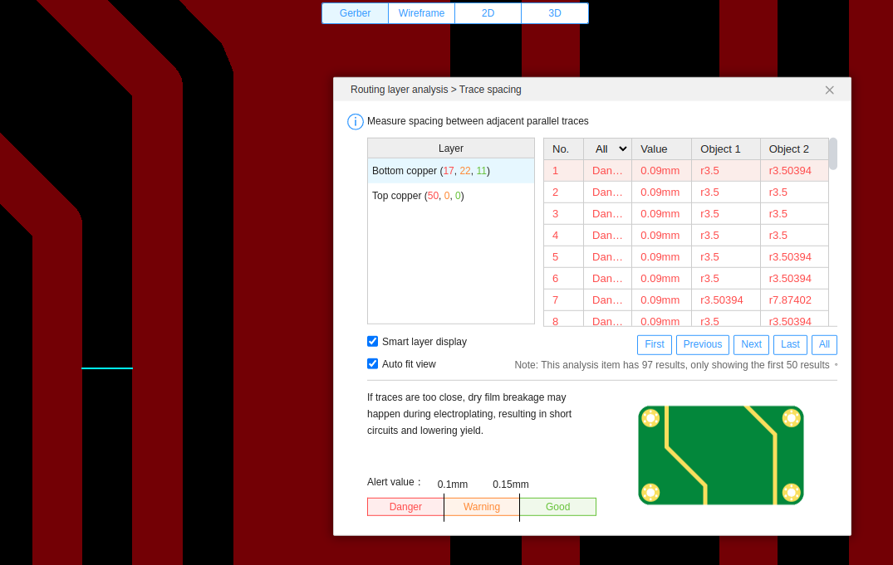  
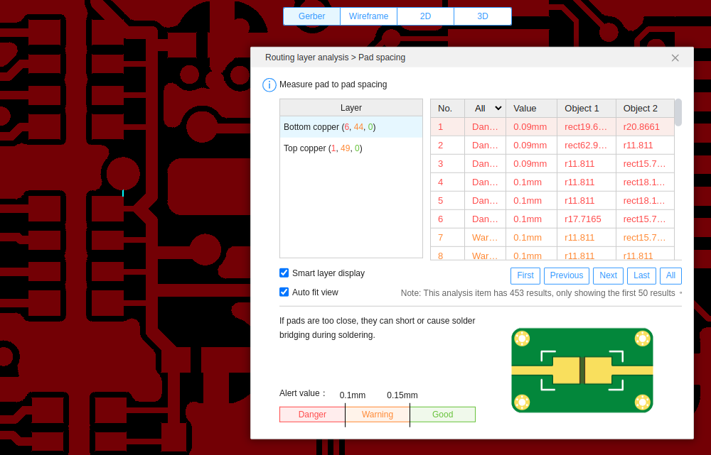  
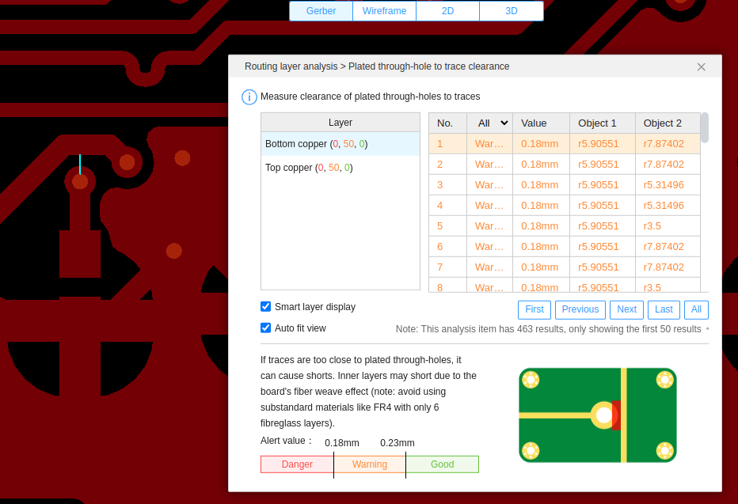  
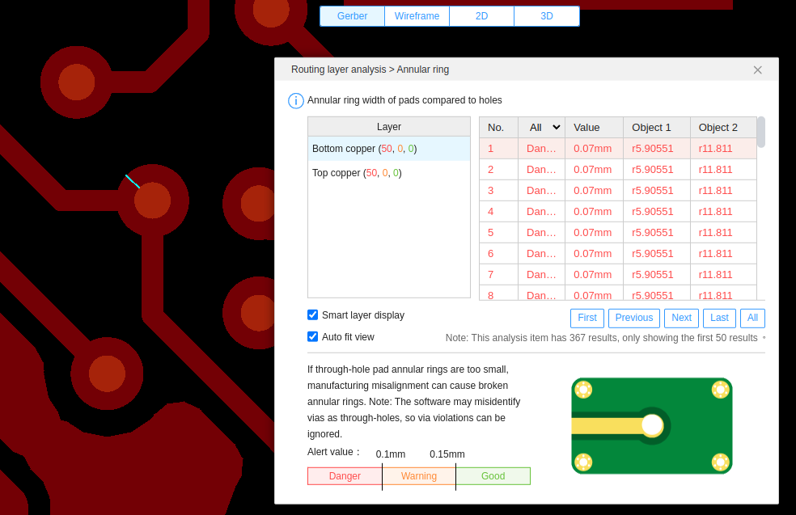  

Note that track width, clearance and pad spacing of less than 0.1mm are marked in the "danger" zone by the DFM tool, in discrepancy with the capability specifications which allow 0.09mm.
A similar situation happens with the annular rings, marked as dangerous if smaller than 0.1mm, where the capabilities allow 0.075mm as the preferred size.

## Conclusion
This analysis was useful in practice, to make the decision of updating the 6-layer board where all vias of 0.25mm outer diameter were changed to 0.3mm, with a correspondingly larger annular ring, thereby reducing manufacturing risks.
  

